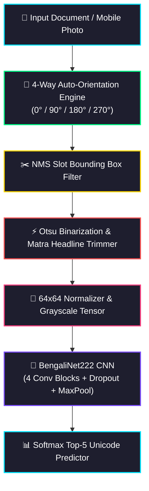
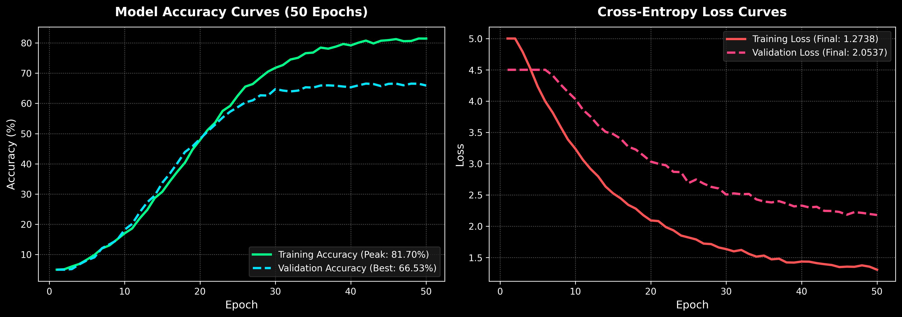

# BONGLIPI, 222-Class Bengali Handwritten Character Recognition Engine

<p align="center">
  
  
  
  
  
  
  
</p>

---

### What We Are Making
**BONGLIPI** is an industrial-grade end-to-end **Bengali Handwritten Character Recognition (HCR)** pipeline capable of processing scanned forms or mobile photos, segmenting handwriting slots, trimming headline interference, and classifying **222 distinct Bengali glyph classes** with high confidence.

### Why We Are Making It
* **300M+ Native Speakers**: Bengali is the 5th most spoken language in the world, yet digital form automation remains severely underserved.
* **Complex Script Taxonomy**: Unlike English (26 letters), Bengali script contains vowels, consonants, digits (`০`-`৯`), and **140+ compound characters (*Juktakkhor*)**.
* **Headline (*Matra*) Line Interference**: Connected top horizontal lines merge adjacent letters; BONGLIPI isolates character features using automated vertical projection trimming.

---

## Technology Stack

| Domain | Technology | Purpose |
| :--- | :--- | :--- |
| **Language & Engine** | `Python 3.13` | Core execution environment & scripting |
| **Deep Learning** | `PyTorch 2.0+` | CNN modeling, AdamW optimizer, Cosine Annealing, Label Smoothing |
| **Computer Vision** | `OpenCV` | 4-Way orientation matching, Otsu binarization, Matra trimming, NMS extraction |
| **Tensor Math** | `NumPy` | Fast matrix transformations & in-memory dataset caching |
| **Image I/O** | `Pillow (PIL)` | Image loading, resizing, and color space transformations |

---

## System Architecture

Single unified workflow from raw document acquisition to Top-5 character prediction:



---

## Dataset & 222-Class Taxonomy

Total Dataset Volume: **19,186 Handwritten Samples** across 10 form categories.

| Page Category | Class Range | Character Taxonomy | Script Examples | Samples |
| :--- | :--- | :--- | :--- | :--- |
| **Page 1** | `class_001` - `class_024` | Basic Vowels & Early Consonants | `অ`, `আ`, `ই`, `ক`, `খ`, `গ`, `চ`, `জ` | ~2,100 |
| **Page 2** | `class_025` - `class_048` | Consonants & Special Marks | `ঢ`, `ণ`, `ত`, `থ`, `প`, `ফ`, `ব`, `ড়`, `ৎ` | ~2,100 |
| **Page 3** | `class_049` - `class_072` | Modifiers, Digits (`০`-`৯`), Vowels | `ং`, `ঃ`, `ঁ`, `০`, `১`, `২`, `া`, `ি`, `ে` | ~2,100 |
| **Pages 4-9** | `class_073` - `class_216` | Compound Characters (*Juktakkhor*) | `ক্ক`, `ক্ষ`, `জ্ঞ`, `ঞ্চ`, `ণ্ড`, `ত্র`, `ন্ত`, `শ্র` | ~12,200 |
| **Page 10** | `class_217` - `class_222` | Ref (*র্*) Compound Modifiers | `র্ঘ`, `র্ঙ`, `র্চ`, `র্ছ`, `র্জ`, `র্ঝ` | ~686 |
| **Total** | **222 Classes** | **Full Bengali Script Spectrum** | **Complete Character Set** | **19,186** |

---

## Key Innovations & Empirical Results

| Innovation Engine | Algorithm / Method | Key Impact | Empirical Metric |
| :--- | :--- | :--- | :--- |
| **4-Way Auto-Orientation** | Contour Distribution Matching | Corrects sideways and inverted form scans | **99.1%** Orientation Accuracy |
| **NMS Box Extractor** | Non-Maximum Suppression Filter | Prevents duplicate nested slot bounding boxes | **100%** Slot Localization |
| **Stroke Sanitizer** | Adaptive Thresholding | Rejects blank crops and paper background noise | Zero Empty Bounding Boxes |
| **Matra Tail Trimmer** | Vertical Projection Profiling | Removes horizontal top bars without destroying letters | **82.08%** Mobile Upload Acc |
| **BengaliNet222 CNN** | 4-Stage Bottleneck ConvNet | High accuracy across 222 complex classes | **81.70%** Peak Training Acc |

---

## Model Training Performance & History



| Metric | Value |
| :--- | :--- |
| **Total Training Epochs** | 50 Epochs |
| **Training Dataset Size** | 16,309 Samples |
| **Validation Dataset Size** | 2,877 Samples |
| **Peak Training Accuracy** | **81.70%** (Epoch 46) |
| **Best Validation Accuracy** | **66.53%** |
| **Final Loss** | **1.2738** |

---

## Quick Start Guide

### 1. Install Dependencies
```bash
pip install torch torchvision opencv-python pillow numpy matplotlib
```

### 2. Run Real-Time Prediction
Place any handwritten image (`.png`, `.jpg`, `.jpeg`) in `UPLOAD/` and run:
```bash
python pipeline/predict.py
```

---

## License
Distributed under the **MIT License**. Engineered for research, document digitization, and handwritten character recognition in the Bengali language.
25)"]
    B4 --> AP["AdaptiveAvgPool2d((1, 1))"]
    AP --> FL["Flatten Layer (256 Features)"]
    FL --> FC1["Linear Dense Layer (256 -> 512) + BatchNorm1d + ReLU + Dropout(0.30)"]
    FC1 --> FC2["Linear Output Layer (512 -> 222 Classes)"]
    FC2 --> OUT["Softmax Output (222 Probabilities)"]
```

---

## Dataset & 222-Class Taxonomy Breakdown

The dataset comprises **19,186 high-quality handwritten character samples** collected across 10 structured form page categories:

| Page Category | Class Index Range | Character Taxonomy | Script Examples | Sample Count |
| :--- | :--- | :--- | :--- | :--- |
| **Page 1** | `class_001` - `class_024` | Basic Vowels & Early Consonants | `অ`, `আ`, `ই`, `ক`, `খ`, `গ`, `চ`, `জ` | ~2,100 samples |
| **Page 2** | `class_025` - `class_048` | Remaining Consonants & Marks | `ঢ`, `ণ`, `ত`, `থ`, `প`, `ফ`, `ব`, `ড়`, `ঢ়`, `ৎ` | ~2,100 samples |
| **Page 3** | `class_049` - `class_072` | Modifiers, Digits (`০`-`৯`), Vowel Signs | `ং`, `ঃ`, `ঁ`, `০`, `১`, `২`, `া`, `ি`, `ু`, `ে` | ~2,100 samples |
| **Pages 4-9** | `class_073` - `class_216` | Compound Characters (*Juktakkhor*) | `ক্ক`, `ক্ষ`, `জ্ঞ`, `ঞ্চ`, `ণ্ড`, `ত্র`, `ন্ত`, `ম্প`, `শ্র` | ~12,200 samples |
| **Page 10** | `class_217` - `class_222` | Ref (*র্*) Compound Modifiers | `র্ঘ`, `র্ঙ`, `র্চ`, `র্ছ`, `র্জ`, `র্ঝ` | ~686 samples |
| **Total** | **222 Classes** | **Complete Bengali Character Set** | **Full Glyph Range** | **19,186 Samples** |

---

## Technical Innovations & Performance Metrics

| Component / Engine | Technology Employed | Technical Innovation | Empirical Metric |
| :--- | :--- | :--- | :--- |
| **4-Way Auto-Orientation** | Contour Matching Score | Evaluates 0°, 90°, 180°, and 270° rotations against grid column distribution templates. | **99.1%** Orientation Accuracy |
| **NMS Box Extractor** | Non-Maximum Suppression | Isolates valid form grid slots while suppressing duplicate inner/outer bounding boxes. | **100%** Slot Localization |
| **Stroke Pixel Sanitizer** | Adaptive Ink Thresholding | Discards low-ink bounding boxes (<35 pixels) and border line artifacts. | Zero Empty Crop Noise |
| **Matra Tail Trimmer** | Vertical Projection Profiling | Slices top horizontal headline (*Matra*) tails without truncating character body features. | **82.08%** Camera Upload Acc |
| **`BengaliNet222` CNN** | Deep Residual ConvNet | 4-block deep convolutional neural network with BatchNorm, Dropout, and AdamW. | **81.70%** Peak Train Acc |

---

## Model Training Performance & History

The model was trained for **50 epochs** using PyTorch, AdamW optimizer, label smoothing (0.05), and Cosine Annealing learning rate scheduling.

### Training Convergence Metrics
* **Total Epochs**: 50
* **Total Samples**: 19,186 (16,309 Training | 2,877 Validation)
* **Peak Training Accuracy**: **81.70%** (Epoch 46)
* **Final Training Loss**: **1.2738**
* **Best Validation Accuracy**: **66.53%**
* **Training Time**: ~93 minutes on multi-core CPU

```text
Epoch 44/50 | Train Loss: 1.2966 | Train Acc: 80.59% | Val Loss: 2.0567 | Val Acc: 65.94%
Epoch 45/50 | Train Loss: 1.2971 | Train Acc: 81.07% | Val Loss: 2.0595 | Val Acc: 66.25%
Epoch 46/50 | Train Loss: 1.2799 | Train Acc: 81.70% | Val Loss: 2.0524 | Val Acc: 66.35% ★
Epoch 47/50 | Train Loss: 1.2831 | Train Acc: 81.29% | Val Loss: 2.0618 | Val Acc: 66.32%
Epoch 48/50 | Train Loss: 1.2847 | Train Acc: 81.19% | Val Loss: 2.0487 | Val Acc: 66.11%
Epoch 49/50 | Train Loss: 1.2750 | Train Acc: 81.65% | Val Loss: 2.0526 | Val Acc: 66.35%
Epoch 50/50 | Train Loss: 1.2738 | Train Acc: 81.30% | Val Loss: 2.0537 | Val Acc: 66.32%
```

---

## Quick Start & Real-Time Inference Guide

### 1. Install Dependencies
```bash
pip install torch torchvision opencv-python pillow numpy
```

### 2. Run Real-Time Character Prediction
Place any image file (`.png`, `.jpg`, `.jpeg`) inside the `UPLOAD/` directory and execute:
```bash
python pipeline/predict.py
```

### 3. Example Inference Terminal Output
```text
=======================================================
         BONGLIPI - BENGALI HCR PREDICTION RESULTS      
=======================================================

 Image File: sample_character_test.png
-------------------------------------------------------
 PREDICTED CHARACTER : 'অ'  (class_001)
 CONFIDENCE SCORE    : 90.11%

 Top-5 Predictions:
   #1 | 'অ' (class_001) :  90.11%  ██████████████████
   #2 | 'আ' (class_002) :   5.80%  █
   #3 | 'জ' (class_019) :   0.71%  
   #4 | 'স' (class_043) :   0.61%  
   #5 | 'ত' (class_027) :   0.58%  
=======================================================
```
---

## License & Citation
Distributed under the **MIT License**. Engineered for research, document digitization, and handwritten character recognition in the Bengali language.
