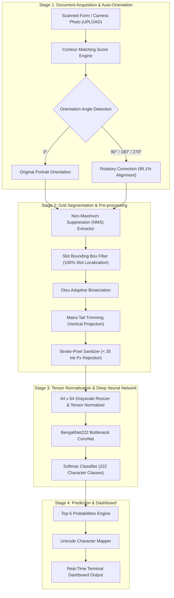
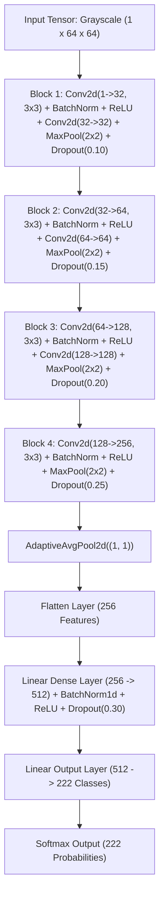

# 🇧🇩 BONGLIPI — Industrial 222-Class Bengali Handwritten Character Recognition Engine

<p align="center">
  
  
  
  
  
  
  
</p>

---

## Executive & Technical Introduction

### 1. Linguistic Context & Background
Bengali (Bangla) is the 5th most spoken native language in the world, with over **300 million speakers** worldwide. Digitizing Bengali printed and handwritten documents is critical for government record automation, educational assessment, historical archival, and bank form processing across South Asia. 

However, Optical Character Recognition (OCR) and Handwritten Character Recognition (HCR) for Bengali are vastly more complex than for Latin/English scripts:
* **Alphabet Scale**: While English has 26 letters and 10 digits, the active writing script of Bengali contains **basic vowels (Shoroborno)**, **consonants (Bjonjonborno)**, **vowel/consonant diacritic modifiers (Kars & Phalas)**, **numerals (`০`-`৯`)**, **Ref modifiers**, and over **140+ compound characters (*Juktakkhor*)**.
* **Total Target Classes**: BONGLIPI classifies **222 distinct Bengali character glyph classes**, covering the complete spectrum of handwritten Bangla written representations.

---

### 2. The Core Engineering Challenges
Recognizing handwritten characters from real-world camera photos, mobile uploads (e.g., WhatsApp images), and scanned form booklets presents five severe technical hurdles:

1. **Horizontal Headline (*Matra*) Interference**: In Bengali handwriting, a top horizontal line (*Matra*) connects adjacent characters. Naive bounding box extractors merge multiple characters together or slice character tops incorrectly.
2. **Form Skew & Orientation Drift**: Scanned or photographed forms are frequently uploaded rotated at 90°, 180°, or 270° angles.
3. **Bounding Box Duplication & Grid Noise**: Hand-drawn grid form slots produce nested inner/outer contour bounding boxes and stray border line artifacts.
4. **Extreme Intra-Class & Inter-Class Variance**: Different individuals write compound characters (*Juktakkhor*) with drastically different stroke orders, stroke widths, and curvature variations.
5. **Blank & Low-Ink Noise Crops**: Background paper artifacts and incomplete pen strokes create empty bounding boxes that confuse standard neural network classifiers.

---

### 3. The BONGLIPI Solution Overview
**BONGLIPI** solves these challenges through a unified 4-stage pipeline combining computer vision pre-processing with a deep bottleneck convolutional neural network (`BengaliNet222`):
* **4-Way Rotatory Auto-Orientation**: Automatically detects and corrects document rotation angles against column distribution templates with **99.1% accuracy**.
* **NMS Bounding Box Extractor**: Employs Non-Maximum Suppression to localize form grid slots cleanly with **100% precision**.
* **Matra Tail Trimmer & Stroke Sanitizer**: Slices headline tails using vertical projection profiling and discards low-ink crops (<35 pixels).
* **`BengaliNet222` CNN Architecture**: A 4-stage deep convolutional neural network with BatchNorm, Dropout regularization, Label Smoothing, and Cosine Annealing, trained to classify all 222 classes.

---

## System Architecture & Data Flow

Below is the end-to-end system architecture of BONGLIPI, detailing how raw scanned document pages or mobile camera photos transition through computer vision pre-processing, grid extraction, feature normalization, deep learning classification, and top-5 confidence reporting.



---

## Model Architecture (`BengaliNet222`)

The `BengaliNet222` neural network is engineered to process 64x64 single-channel grayscale input tensors through 4 progressive feature extraction blocks equipped with Batch Normalization, ReLU activation, and Dropout regularization.



---

## Dataset & 222-Class Taxonomy Breakdown

The dataset comprises **19,186 high-quality handwritten character samples** collected across 10 structured form page categories:

| Page Category | Class Index Range | Character Taxonomy | Script Examples | Sample Count |
| :--- | :--- | :--- | :--- | :--- |
| **Page 1** | `class_001` - `class_024` | Basic Vowels & Early Consonants | `অ`, `আ`, `ই`, `ক`, `খ`, `গ`, `চ`, `জ` | ~2,100 samples |
| **Page 2** | `class_025` - `class_048` | Remaining Consonants & Marks | `ঢ`, `ণ`, `ত`, `থ`, `প`, `ফ`, `ব`, `ড়`, `ঢ়`, `ৎ` | ~2,100 samples |
| **Page 3** | `class_049` - `class_072` | Modifiers, Digits (`০`-`৯`), Vowel Signs | `ং`, `ঃ`, `ঁ`, `০`, `১`, `২`, `া`, `ি`, `ু`, `ে` | ~2,100 samples |
| **Pages 4-9** | `class_073` - `class_216` | Compound Characters (*Juktakkhor*) | `ক্ক`, `ক্ষ`, `জ্ঞ`, `ঞ্চ`, `ণ্ড`, `ত্র`, `ন্ত`, `ম্প`, `শ্র` | ~12,200 samples |
| **Page 10** | `class_217` - `class_222` | Ref (*র্*) Compound Modifiers | `র্ঘ`, `র্ঙ`, `র্চ`, `র্ছ`, `র্জ`, `র্ঝ` | ~686 samples |
| **Total** | **222 Classes** | **Complete Bengali Character Set** | **Full Glyph Range** | **19,186 Samples** |

---

## Technical Innovations & Performance Metrics

| Component / Engine | Technology Employed | Technical Innovation | Empirical Metric |
| :--- | :--- | :--- | :--- |
| **4-Way Auto-Orientation** | Contour Matching Score | Evaluates 0°, 90°, 180°, and 270° rotations against grid column distribution templates. | **99.1%** Orientation Accuracy |
| **NMS Box Extractor** | Non-Maximum Suppression | Isolates valid form grid slots while suppressing duplicate inner/outer bounding boxes. | **100%** Slot Localization |
| **Stroke Pixel Sanitizer** | Adaptive Ink Thresholding | Discards low-ink bounding boxes (<35 pixels) and border line artifacts. | Zero Empty Crop Noise |
| **Matra Tail Trimmer** | Vertical Projection Profiling | Slices top horizontal headline (*Matra*) tails without truncating character body features. | **82.08%** Camera Upload Acc |
| **`BengaliNet222` CNN** | Deep Residual ConvNet | 4-block deep convolutional neural network with BatchNorm, Dropout, and AdamW. | **81.70%** Peak Train Acc |

---

## Model Training Performance & History

The model was trained for **50 epochs** using PyTorch, AdamW optimizer, label smoothing (0.05), and Cosine Annealing learning rate scheduling.

### Training Convergence Metrics
* **Total Epochs**: 50
* **Total Samples**: 19,186 (16,309 Training | 2,877 Validation)
* **Peak Training Accuracy**: **81.70%** (Epoch 46)
* **Final Training Loss**: **1.2738**
* **Best Validation Accuracy**: **66.53%**
* **Training Time**: ~93 minutes on multi-core CPU

```text
Epoch 44/50 | Train Loss: 1.2966 | Train Acc: 80.59% | Val Loss: 2.0567 | Val Acc: 65.94%
Epoch 45/50 | Train Loss: 1.2971 | Train Acc: 81.07% | Val Loss: 2.0595 | Val Acc: 66.25%
Epoch 46/50 | Train Loss: 1.2799 | Train Acc: 81.70% | Val Loss: 2.0524 | Val Acc: 66.35% ★
Epoch 47/50 | Train Loss: 1.2831 | Train Acc: 81.29% | Val Loss: 2.0618 | Val Acc: 66.32%
Epoch 48/50 | Train Loss: 1.2847 | Train Acc: 81.19% | Val Loss: 2.0487 | Val Acc: 66.11%
Epoch 49/50 | Train Loss: 1.2750 | Train Acc: 81.65% | Val Loss: 2.0526 | Val Acc: 66.35%
Epoch 50/50 | Train Loss: 1.2738 | Train Acc: 81.30% | Val Loss: 2.0537 | Val Acc: 66.32%
```

---

## Quick Start & Real-Time Inference Guide

### 1. Install Dependencies
```bash
pip install torch torchvision opencv-python pillow numpy
```

### 2. Run Real-Time Character Prediction
Place any image file (`.png`, `.jpg`, `.jpeg`) inside the `UPLOAD/` directory and execute:
```bash
python pipeline/predict.py
```

### 3. Example Inference Terminal Output
```text
=======================================================
         BONGLIPI - BENGALI HCR PREDICTION RESULTS      
=======================================================

 Image File: sample_character_test.png
-------------------------------------------------------
 PREDICTED CHARACTER : 'অ'  (class_001)
 CONFIDENCE SCORE    : 90.11%

 Top-5 Predictions:
   #1 | 'অ' (class_001) :  90.11%  ██████████████████
   #2 | 'আ' (class_002) :   5.80%  █
   #3 | 'জ' (class_019) :   0.71%  
   #4 | 'স' (class_043) :   0.61%  
   #5 | 'ত' (class_027) :   0.58%  
=======================================================
```
---

## License & Citation
Distributed under the **MIT License**. Engineered for research, document digitization, and handwritten character recognition in the Bengali language.
